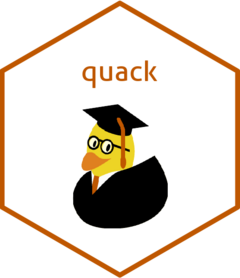

# quack 

<!-- badges: start -->
[](https://www.gnu.org/licenses/gpl-3.0)

<!-- badges: end -->

Don't be a 'quackademic'!
Manage your research projects in an organized and consistent way.
This package provides an R Project template to setup research project directories in a consistent way conveniently.

## Installation

You can install the development version of quack from [GitHub](https://github.com/) with:

``` r
# install.packages("devtools")
devtools::install_github("duckmayr/quack")
```

## Contributing

Before contributing, please consult the contributing guidelines in CONTRIBUTING.md, as well as the code of conduct in CODE_OF_CONDUCT.md.
